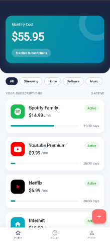
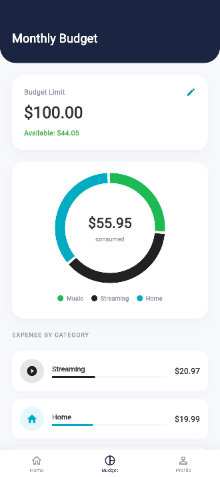
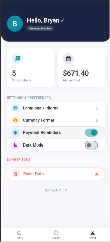

# SubTrack

Creé esta aplicación porque necesitaba una forma sencilla y visual de llevar el control de mis gastos fijos sin complicaciones ni hojas de cálculo pesadas. Está construida completamente en Flutter y pensada para resolver tres problemas concretos: saber cuánto dinero se va cada mes en suscripciones, ver en qué categorías se gasta más y recordar qué días tocan los cobros.

---

## Qué hace la aplicación

* Control de gastos en una sola vista: La pantalla principal muestra el costo mensual acumulado y la lista de todos los servicios activos.
* Organización clara: Permite clasificar cada suscripción (como entretenimiento, herramientas de trabajo o servicios del hogar) para mantener el balance a la vista.
* Gráfico de presupuesto: Una vista analítica con gráfico circular animado que compara el total consumido contra el límite mensual que tú mismo defines.
* Manejo de monedas e idiomas: Incluye soporte para cambiar el formato de moneda y alternar entre español e inglés de manera inmediata.
* Estilo visual adaptativo: Reconoce automáticamente servicios conocidos (como Spotify o Netflix) y les aplica el color o icono característico para que la lista sea fácil de escanear.
* Datos guardados en el dispositivo: Toda la información se almacena localmente de forma rápida sin depender de un servidor externo.

---

## Interfaz

| Inicio | Presupuesto | Perfil |
| :---: | :---: | :---: |
|  |  |  |

---

## Herramientas utilizadas

* Framework: Flutter (lenguaje Dart).
* Librerías principales: 
  * shared_preferences para la persistencia local.
  * font_awesome_flutter para logotipos vectoriales de marcas.
* Diseño e interfaz: Componentes nativos de Material Design y trazado manual mediante CustomPainter para la animación del gráfico circular.

---

## Cómo probar el proyecto localmente

Si quieres clonar y correr la app en tu entorno, ejecuta estos comandos en tu terminal:

    # 1. Clona el repositorio
    git clone [https://github.com/Aaron09C5/gestor-suscripciones.git](https://github.com/Aaron09C5/gestor-suscripciones.git)

    # 2. Entra a la carpeta del proyecto
    cd gestor-suscripciones

    # 3. Descarga las dependencias
    flutter pub get

    # 4. Conecta tu teléfono o inicia un emulador y corre
    flutter run

---

## Generar el archivo instalable (APK)

Para compilar la versión optimizada que se puede instalar directamente en un teléfono Android:

    flutter build apk --split-per-abi

El instalable para la mayoría de teléfonos actuales se genera en la ruta:  
`build/app/outputs/flutter-apk/app-arm64-v8a-release.apk`